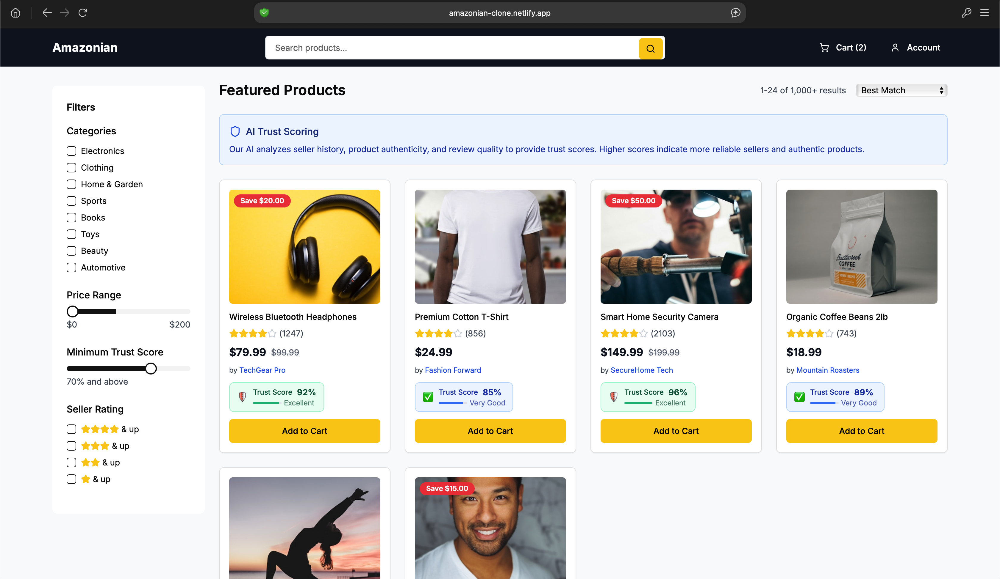

## Amazon clone
This project, **Amazon Clone**, is a fully functional e-commerce web application built with **Next.js**. It replicates key features of the Amazon platform, including product browsing, user authentication, shopping cart management, and order placement. With a responsive design, seamless user experience, and integration with a backend API, this project demonstrates a robust and scalable e-commerce solution.

- Product browsing and search functionality
- Shopping cart management
- Order placement and checkout process
- Responsive design for mobile and desktop

### Product Images



## Live Demo

Check out the live demo of the project [here](https://amazonian-clone.netlify.app).

## Installation

Follow these steps to set up the project:

1. Clone the repository:
    ```bash
    git clone https://github.com/okotdaniel/amazon-ecommerce-clone.git
    cd amazon-ecommerce-clone
    ```

2. Install dependencies:
    ```bash
    npm install
    ```

3. You can also install the dependancies using pnpm.
    ```bash
    npm install -g pnpm
    ```
    Then
     ```bash
    pnpm install
    ```

## Usage

### Development

To run the development server:
    ```bash
    npm run dev
    ```
Or 
    ```bash
    npm run dev
    ```
Open [http://localhost:3000](http://localhost:3000) in your browser to see the application.

### Production

To build and start the production server:
```bash
npm run build
npm start
```

## Dockerized Installation

You can also set up the project using Docker:

1. Build the Docker image:
    ```bash
    docker compose up --build .
    ```

Open [http://localhost:3000](http://localhost:3000) in your browser to see the application running inside the Docker container.

## Contribution

Feel free to fork the repository and make a pull request. Contributions are welcome!
